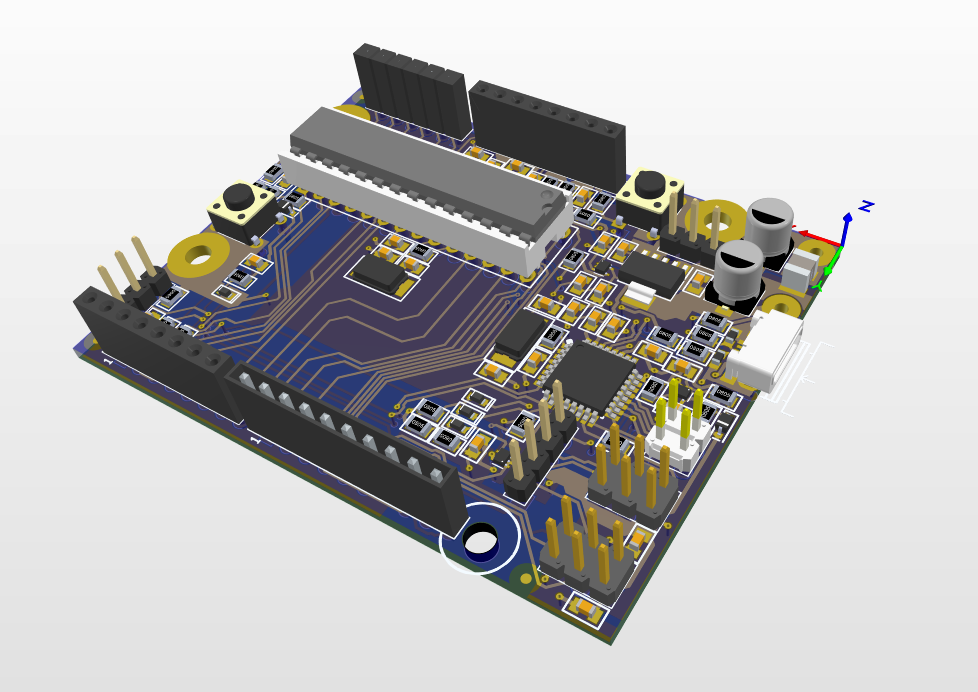
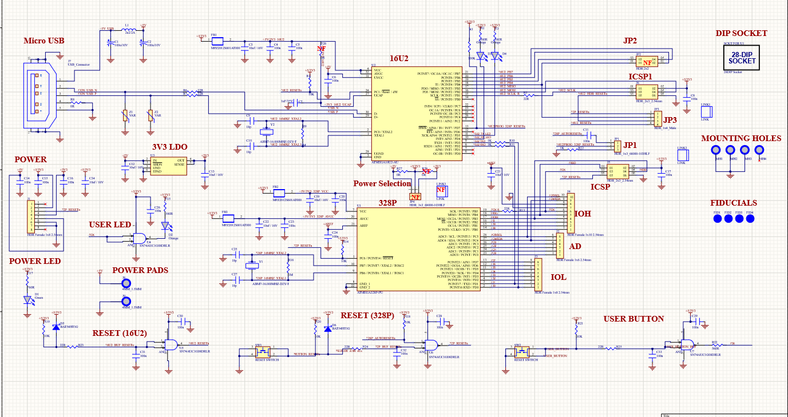
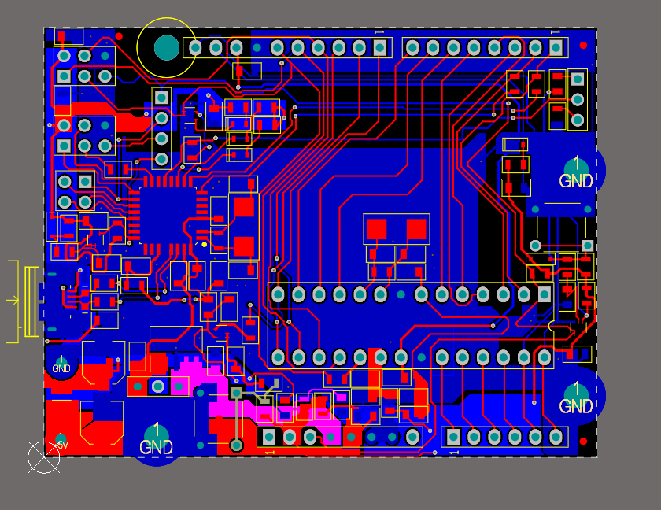

# AVR Microcontroller Design | IPD Task 01

## Project Overview
This repository contains the full design for **Task 01** of **IPD** . The project focuses on the hardware implementation of an 8-bit AVR-based microcontroller system.

This submission fulfills the requirements for hosting all logic schematics, physical PCB layouts.

---

## 🖼 Design Gallery

### 1. 3D Visualization

### 2. Schematic View

### 3. PCB Layout

---

## ⚖️ License
This project is licensed under the **MIT License** - see the [LICENSE](LICENSE) file for details.

---

**Author:** Pujan Oza 
**Course:** IPD
**Submission:** Task 01
